# Transit Only Lanes in San Francisco

## Introduction

San Francisco’s transit only lanes are lanes determined by the San Francisco Municipal Transportation Agency (SFMTA) that are dedicated to MUNI vehicles and other buses. According to [SFMTA](https://www.sfmta.com/blog/everything-you-need-know-about-red-transit-lanes), taxis are sometimes allowed on transit only lanes, but app-based rail hail service vehicles, such as Uber and Lyft, are never allowed.

Transit only lanes are important because they help reduce traffic congestion, and therefore reduce air pollution. They also help improve MUNI performance. With faster and more reliable service, transit only lanes can encourage more people to choose transit over automobiles.

To achieve the goal of relieving congestion and improving accessibility for people in the community, it is important to look at the implementation and impact of the transit only lanes.This project analyzed demographic data and congestion data to find out the spatial pattern of transit only lanes. It also assessed the relationship of transit only lanes and two important performance parameters of public transit systems: ridership and on-time performance.

## Data

Below are the datasets used in the project. Because the pandemic has caused significant change in people’s travel patterns and bus scheduling, we focused our study on bus ridership and performance before the pandemic.

+ [Age and sex](https://data.census.gov/cedsci/table?t=Populations%20and%20People&g=0500000US06075%241400000&y=2019&tid=ACSST5Y2019.S0101) - American Community Survey
+ [Means of transportation](https://data.census.gov/cedsci/table?t=Commuting&g=0500000US06075%241400000&y=2019&tid=ACSST5Y2019.S0802) - American Community Survey
+ [Transit only lanes](https://data.sfgov.org/Transportation/Transit-Only-Lanes/tzh6-6j82) - DataSF
+ [Congestion in San Francisco](https://congestion.sfcta.org/) - SFCTA Congestion Management Program
+ [Muni on-time performance](https://www.sfmta.com/reports/muni-time-performance) - SFMTA
+ [2006 Muni ridership](https://archives.sfmta.com/cms/rtep/tepdataindx.htm) - SFMTA
+ 2016 - 2022 MUNI ridership - SFMTA (Requested via [Open Public Records](https://sanfrancisco.nextrequest.com/))
+ [San Francisco Muni metro performance statistics](https://www.sfog.us/sfmuni.htm) - SFOG.us
+ [SFMTA GTFS feed](https://www.transit.land/feeds/f-9q8y-sfmta) - Transitland
+ [California census tracts](https://www.census.gov/cgi-bin/geo/shapefiles/index.php?year=2019&layergroup=Census+Tracts) - US Census Bureau

## Methodology

### Workflow

Figure 1 is the workflow of the project indicating how datasets were used to answer the research questions.

| 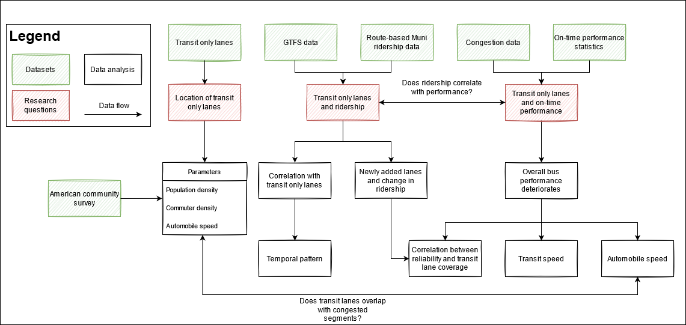 | 
|:--:| 
| Figure 1. Project workflow |

### Python Packages

The project used **pandas** and **geopandas** to process data and used **matplotlib** to create the visualizations.

### Processing Ridership Data

One challenge we met was to match the route-based ridership data with each street segment. Specifically,

1. Using route-based ridership (daily boarding on each route) directly would overestimate the traversal on each segment since most people don’t ride the entire route.  
2. Many routes have overlapping segments with other routes. The ridership needs to be summed to reflect the total traversal.

#### Distribution

To solve the first issue, we divided the number of boarding by the number of segments in the General Transit Feed Specification (GTFS) shapefile. Because the segments are usually short (i.e., there are a lot of segments on each bus route), this led to a lower estimate of ridership. Meanwhile, the estimate was likely to be biased because transit demand usually follows a spatial pattern (e.g., higher demand in the commercial areas) and doesn’t distribute uniformly along the route. More detailed information about commuters’ origin and destination is needed to obtain a more realistic distribution of ridership. In this project, we used a uniform distribution for simplicity.

### Aggregation

To get the total traversals, we summed up ridership of segments with the same start point and end point. While the solution was effective for most segments, it still has a few caveats.

1. It fails to recognize segments that didn't overlap completely.  
2. When segments are close (e.g., inbound and outbound segments in different directions of the same street), it is hard to differentiate them on the plot.

For simplicity, we applied a 50% transparency to the ridership to make sure the partially overlapping segments and adjacent segments could be seen.

## Visualization Results

### Location

According to [SFMTA](https://www.sfmta.com/blog/everything-you-need-know-about-red-transit-lanes), transit only lanes have a long history (over 40 years) in San Francisco. Today, the city has more than 43 miles of dedicated lanes. During the Pandemic, to protect essential workers and transit dependents, SFMTA also implemented [Temporary Emergency Transit Lanes](https://www.sfmta.com/projects/temporary-emergency-transit-lanes) that would benefit communities with higher percentages of low-income households and people of color. The figure below shows all transit only lanes (temporary and permanent) in the city.

| 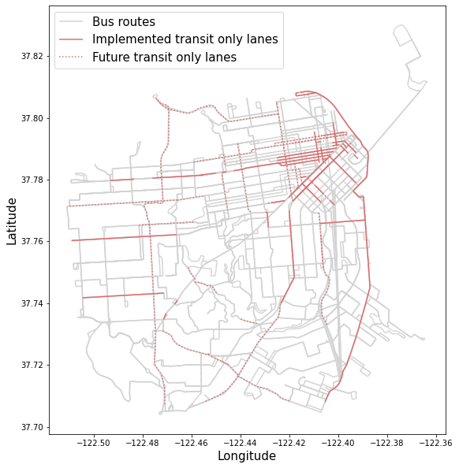 | 
|:--:| 
| Figure 2. Transit only lanes in San Francisco |

To assess whether the locations of transit only lanes match with demand, we used the population and commuter data from the 2019 American Community Survey. The plots below show the density of population (left) and transit commuter (right) in each census tract. Visually, it can be seen that there is a match. The pattern is more significant between transit only lanes and commuter density.

| 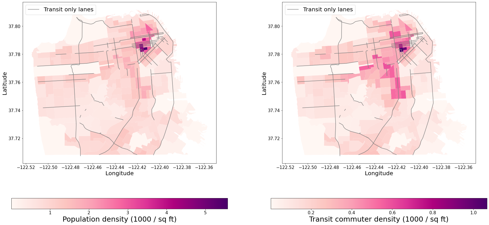 | 
|:--:| 
| Figure 3. Population density (left) and transit commuter density (right) in SF |

### Ridership

The plots below show the average daily traversals (left) and transit lanes (right) in 2016. The transit only lanes concentrated near downtown and the port. The ridership follows a similar pattern, which indicates there is a correlation between them.

| 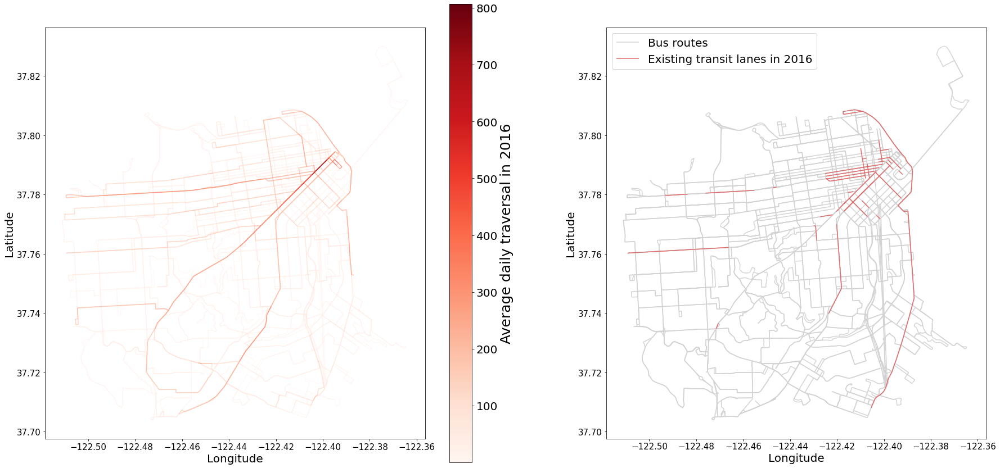 | 
|:--:| 
| Figure 4. Ridership and transit lanes in 2016 |

The second set of plots show the ridership in 2019 and transit lanes proposed in the Temporary Emergency Transit Lanes project (dashed lines). While the ridership pattern doesn’t show a significant change from 2016, more transit lanes are planned and implemented in the west and south part of the city.

| 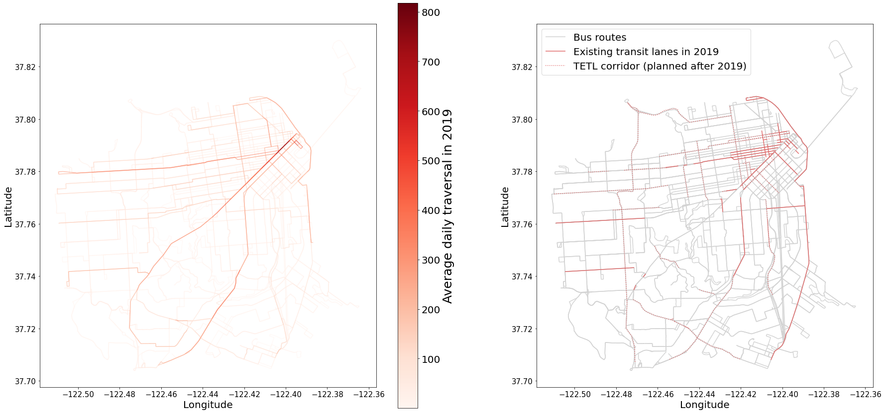 | 
|:--:| 
| Figure 5. Ridership and transit lanes in 2019 |

To further study the relationship, we focused the next set of plots on the changes between 2016 and 2019. The newly added lanes can be categorized into two groups

+ segments that connect existing transit lanes, and
+ separate segments.

From the ridership plot, the first group corresponded to a larger increase in ridership of the entire bus route. However, the separate segments did not have a significant impact on ridership.

| 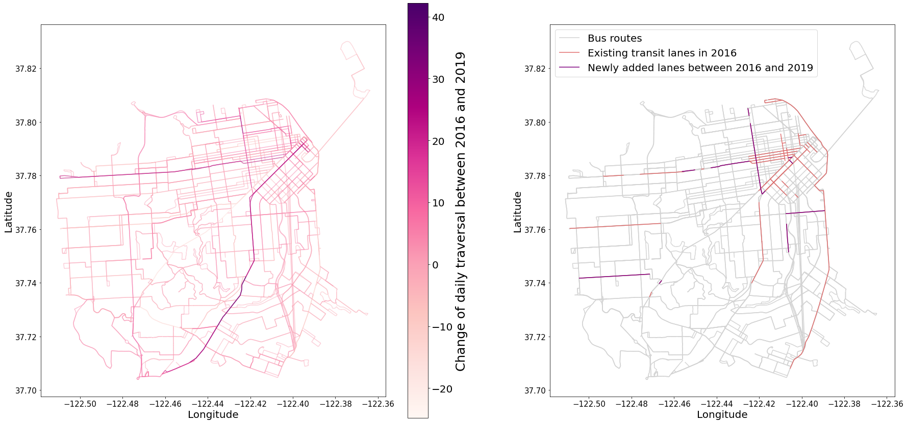 | 
|:--:| 
| Figure 6. Change of ridership and transit only lanes from 2016 to 2019 |

### On-Time Performance

#### Context: Overall Traffic Performance

According to the [congestion data](https://congestion.sfcta.org/) from SFCTA, from 2006 to 2019, the overall traffic performance has deteriorated in San Francisco. In terms of travel speed, transit is constantly lower than automobiles due to time loss during boarding, alighting, acceleration, and deceleration. However, while the average automobile speed in major corridors decreased by about 25% from 2006 to 2019, the average transit speed stayed stable.

| 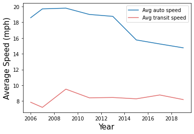 | 
|:--:| 
| Figure 7. Average automobile and transit speed in major corridors in SF |

The table below compares the average speed on segments with and without transit only lanes. Surprisingly, both automobile and transit speeds are lower on segments with transit only lanes. The reason might be that transit only lanes are often implemented on the busiest and thus the most congested corridors. By improving transit performance, the hope is to attract more people to choose transit and therefore mitigate congestion.

| Segment type | Average auto speed | Sample size (auto) | Average transit speed | Sample size (transit) |
|:--:|:--:|:--:|:--:|:--:|
| Segments w/ transit only lanes | 13.78 | 186 | 7.44 | 97 |
| Segments w/o transit only lanes | 15.28 | 59 | 8.88 | 21 |
| All segments | 14.13 | 246 | 7.69 | 118 |

#### Temporal Trend

For the on-time performance change, we searched the on-time performance data since 2004 and compared the performance. Since we had limited data, we plotted on-time performance of J, K, L, M and N routes.

Figure 8 shows how on-time performance changed during the period of 2004 to 2010. It demonstrates clearly that most of the routes had worse performance, especially K and L. As for the total performance, all routes experienced  strong fluctuations.

| 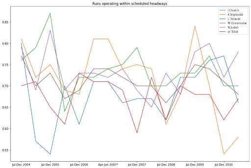 | 
|:--:| 
| Figure 8. Route-based on-time performance from 2004-2010 | 

We chose some critical time points to show the results. The plots below show their performance in some specific years. At the beginning of the research period (2006), according to Figure 9, the majority of the buses had good performance, even on the most congested corridors with the highest demands. 

| 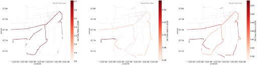 | 
|:--:| 
| Figure 9. On-time performance in 2006, 2016 and 2019 | 

Figure 9 also shows their performance in 2016. There were obvious differences since 2006. Many segments that had an on-time rate of over 0.7 saw a decrease to 0.4. 

According to the on-time performance in 2019, the on-time performance recovered slightly from 2016. Those routes having under 0.45 on time rate had grown to around 0.5. When spatially joined with transit only lanes (gray lines), none of the plots shows a significant relationship between transit lanes and on-time performance.

| 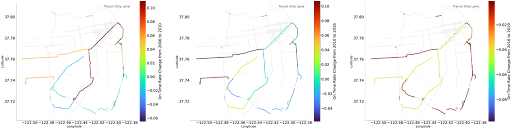 | 
|:--:| 
| Figure 10. Change in on-time performance from 2006 to 2010, from 2010 to 2016, and from 2016 to 2019 (from left to right) | 

The first plot from Figure 10 shows the change in on-time performance from 2006 to 2010. During this period, the overall performance increased at a small rate.

The second plot from Figure 10 above displays the changes from 2010 to 2016. In this time period, the on-time performance showed a similar trend, but a narrow range of routes had increased punctuality rate. However, the decreasing range was wider than before according to the results. 

The third plot from Figure 10 shows the change of on-time performance from 2016 to 2019. From the color, we can know that there was a significant decline for separate lines. All of the routes performed worse.

#### On-Time Performance VS ridership

From the results above, we know that the on-time performance deteriorated in general, but we want to study further whether the decrease in performance affected the ridership of these lines. The pictures below demonstrate whether there is correlation between decreasing performance and increasing ridership.

| 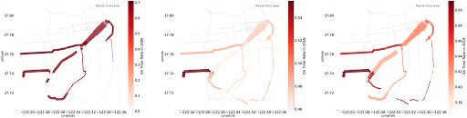 | 
|:--:| 
| Figure 11. On time performance with ridership in 2006, 2016 and 2019(from left to right) | 

These graphs show the ridership and on-time performance in different years. The linewidth reflects the ridership on an average day. Different from our a-priori, some segments with relatively low reliability had the highest ridership. The reason might be that these segments with highest travel demands are located at the busiest and most congested areas, so it is difficult for Muni buses to keep with the schedule. The result suggests there is no significant correlation between on-time performance and ridership.

| 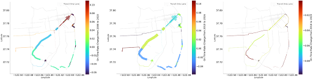 | 
|:--:| 
| Figure 12. Comparison of On time performance and ridership changes from 2006 to 2010, from 2010 to 2016, and from 2016 to 2019 (from left to right) | 

Comparing the changes in performance and ridership, Figure 12 demonstrates that routes which had a larger growth of ridership had no significant improvement in punctuality. Specifically, in the first plot, which shows the trend during the period of 2006 to 2010, both segments with lower punctuality and higher punctuality saw an increase in ridership. For 2016 to 2019, performance deteriorated uniformly in the network. Nevertheless, all bus lines experienced growth in ridership. Throughout the period of interest, Market St. (the diagonal street in the plots) experienced declining on-time performance and increasing ridership, which is unexpected. The result implies that ridership is mainly affected by other factors such as employment and business density.

## Discussion

### Location

While the implemented transit only lanes mainly concentrate near downtown and the port, the newly proposed Temporary Emergency Transit Lanes cover more neighborhoods in the west and south part of San Francisco. The pattern matches SFMTA’s goal to achieve equity in the TETL program. Below is a GIS map showing the number of households in poverty in each census tract. The result shows that the TETL corridors help connect many of the neighborhoods with high numbers of poverty households.

| 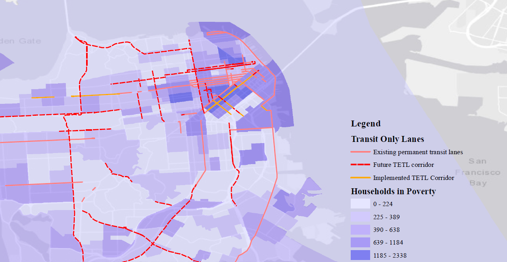 | 
|:--:| 
| Figure 13. Transit only lanes and household in poverty | 

### Ridership

As our result shows, there is a correlation between ridership and the existence of transit only lanes. The impact can happen in both ways. On one hand, commuters might choose to take buses because the transit only lanes improve the bus performance. On the other hand, SFMTA might implement transit only lanes because there is a high demand for transit. Statistical models and data over a longer period are needed to determine whether the causal relationship lies in one direction or both.

However, one point worth mentioning is the different ridership change on newly added transit lanes. As shown in Figure 6, the newly added lanes that connected the existing one corresponded to a larger increase in ridership, while the separate ones did not have a significant effect. One possible explanation is that the change in travel time and reliability from one short segment of transit only lane is not enough to attract riders. However, when they are connected, the accumulated effect might attract more passengers to choose buses over passenger vehicles.

### On-Time Performance

Though our results show that there is a relationship between transit only lanes and ridership, there is no evident enhancement on on-time performance. One possible reason is that the overall traffic performance (including automobiles) has deteriorated in San Francisco, and the transit only lanes might be implemented to mitigate the effect. According to [SFMTA](https://www.sfmta.com/blog/everything-you-need-know-about-red-transit-lanes), the transit only lanes installed on Geary Boulevard made trips on 38R Geary Rapid 20% faster. More detailed travel time data is needed to further study the impact of transit lanes on trip time and reliability.
 
The growth of ridership has a weak relationship with the on time performance. Even though the punctuality rate has declined, it has no obvious effect on the ridership. This suggests that the demand for public transit is rather inelastic. For public agencies, instead of prioritizing on-time performance as the key for attracting more riders, a more systematic approach that considers service quality, frequencies, accessibility, equity, as well as reliability is needed to attract more riders. 

## Limitations / Future Research

### Overlapping Routes

The granularity of shape data has caused overlaps in each section of route. As a consequence, some sections of routes with overlapped shapes could not be counted as a whole. Since some segments with different origins and destinations traversing the same road portion cannot be aggregated by the overlapping parts, our results have failed to quantitatively represent total ridership on each road segment. We can only visualize the overlapping sections by adjusting the transparency. In future research, more advanced python or GIS techniques can be used to detect overlapping portions and to fully aggregate the ridership by segment. 

### Limited Data

The records for ridership and on time performance are measured by year, which means the results utilized are the annual average. The average data can show the overall situation, but it obscures important details. For example, there are significant differences during different time periods of the day. Residents using public transit at the peak hours or off-peak hours may have different preferences. As the granularity of the data is not so specific, we cannot study their characteristics. To study how transit only lanes impact ridership and on-time performance, we need hourly data to show the trends over the day.

Meanwhile, our data only includes a few routes in the period of 2006 to 2010, which introduces a sample error and makes it hard to compare directly with more recent data. Though we have more complete data in 2016 to 2019, it is a short period for SFMTA to implement transit infrastructures and for people to change their travel behavior. More complete data over a longer period of time is needed to quantitatively verify the results in this study.

### Impact of the Pandemic

The pandemic has affected the traffic situation in multiple ways. There are less automobiles on the road, which relieves congestion and enables SFMTA to implement the Temporary Emergency Transit Lanes (TETL). However, bus ridership has also decreased significantly and SFMTA has cut multiple routes and reduced frequency for others. Due to the time and scope of this project, we didn’t study the ridership and on-time performance after the pandemic. As congestion has gradually made a comeback to the city, more research is needed to evaluate the effectiveness of the TETL.

### Different Situations

Muni buses serve a wide range of people for a variety of purposes. And different riders react differently to service changes. Some trips, such as leisure trips to parks, might be more elastic in time and mode, while other trips, such as trips to school and work, are much more inelastic, especially for transit dependents. In addition, weekend and holiday trips also have very different characteristics with weekday trips. These differences are all ignored by the annual average data. 

Meanwhile, transit only lanes not only offer accessible and equity mobility opportunities to residents, but can also play an important role in improving tourism and sustainable transportation. Based on this consideration, studying the usage of transit only lanes on different events also has essential meaning. It would be worth paying attention to the roles Muni buses and  transit only lanes play in various cases to study how they benefit the community in addition to traffic performances.

## Conclusion

From the result above, we can conclude that the location of implemented transit only lanes match with travel demand, especially the distribution of transit commuters, in San Francisco. In contrast, the newly approved temporary lanes have a different focus to help connect neighborhoods with higher numbers of low income households.

There is a clear relationship between Muni ridership and transit only lanes. Specifically, the transit lanes connecting existing ones correspond to a larger increase in ridership. However, further research is needed to determine the direction of causality. In terms of on-time performance, there is no strong relationship with transit only lanes. There is also no strong relationship between ridership and reliability. While the on-time performance has deteriorated between 2006 to 2019, most routes have seen an increase in ridership,

## Reference

+ [Everything you need to know about red transit lanes](https://www.sfmta.com/blog/everything-you-need-know-about-red-transit-lanes) - SFMTA
+ [Temporary emergency transit lanes](https://www.sfmta.com/projects/temporary-emergency-transit-lanes) - SFMTA
+ [How to process GTFS data using pandas & geopandas](https://max-coding.medium.com/how-to-process-gtfs-data-using-pandas-geopandas-4b34f2ad3273) - Maksym Kozlenko
